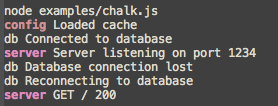

hashpick
========

Pick an item from an array based on the hash of a value. Useful if you want to consistently map data
that's not known beforehand to a discrete set of target values.

In short, this module enables you to do something like this:

``` javascript
const chalk = require('chalk');
const pickColor = require('hashpick')([
    chalk.red,
    chalk.green,
    chalk.yellow,
    chalk.blue,
    chalk.magenta,
    chalk.cyan,
    chalk.gray,
]);

const colorize = (str) => {
    const color = pickColor(str);
    return chalk.bold(color(str));
};

console.log(colorize('config'), 'Loaded cache');
console.log(colorize('db'), 'Connected to database');
console.log(colorize('server'), 'Server listening on port 1234');
console.log(colorize('db'), 'Database connection lost');
console.log(colorize('db'), 'Reconnecting to database');
console.log(colorize('server'), 'GET / 200');
```



## Installation

``` shell
npm install --save hashpick
# or
yarn add hashpick
```

## Usage

Use the exported function to create a new picker-function based on an array of choices:

``` shell
const hashpick = require('hashpick');
const pickNumber = hashpick(['one', 'two', 'three']);

pickNumber('any value'); // -> 'three'
```


## API

### `hashpick(choices: T[]): (string) => T`

Creates a new picker that will consistently pick the same value from `choices` based on its input.
